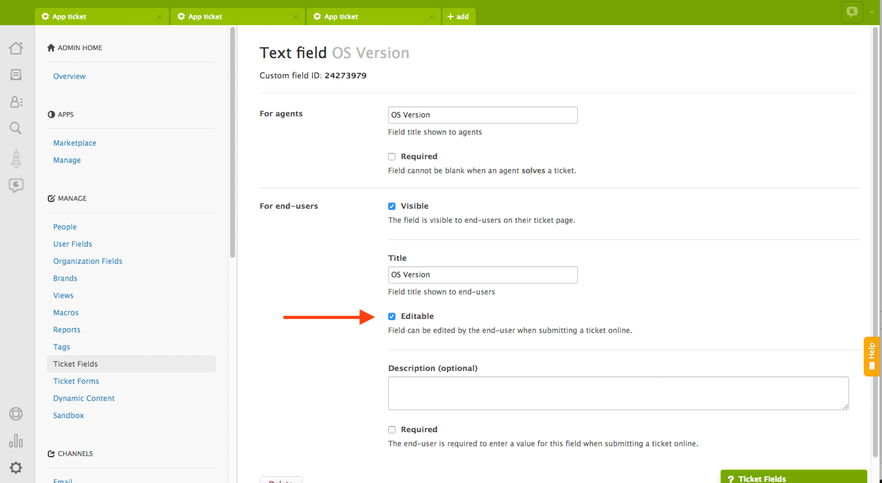
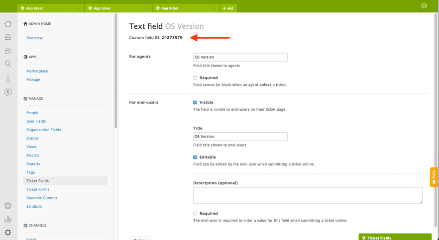
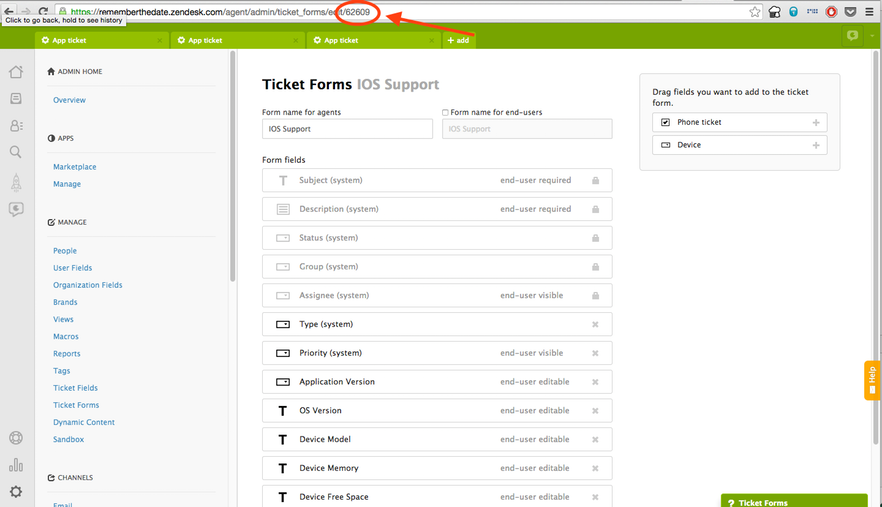

Zendesk provides a number of ways to add additional information to tickets. This helps provide context for agents or can even be used to trigger business logic. The iOS and Android mobile SDKs provide four ways to append additional information to created tickets. This information is stored globally so it can be set at any time before a ticket is created and will be added to every ticket submitted over the lifetime of the app. Below is a brief summary followed by examples of how to use each type in the mobile SDKs. All of the examples below add metadata to tickets created by the Zendesk Mobile SDK. They have no effect on the UI provided with the SDK.


* **Ticket Fields:** Ticket fields contain data about a ticket, such as subject, requester, status, and description. For more information please see [About Ticket Fields](https://support.zendesk.com/hc/en-us/articles/203661506-About-ticket-fields).
* **Tags:** Tags are strings you can use to add more context to tickets. For more information please see [Using Tags](https://support.zendesk.com/hc/en-us/articles/203662096-Using-tags).
* **Additional Text:** The iOS and Android mobile SDKs allow you to appended additional text directly to each ticket created.
* **Ticket Forms (Enterprise only):** A ticket form is a set of predefined ticket fields for a specific support request. For more information please see [Creating Ticket Forms](https://support.zendesk.com/hc/en-us/articles/203661616-Creating-ticket-forms-to-support-multiple-request-types-Enterprise-).


### Ticket Fields
One important prerequisite before adding ticket fields to requests created in the mobile SDKs is to make said ticket fields editable by end-users, as all of the Mobile SDKs interactions with Zendesk are done so from the perspective of an end user. If you do not do this the values set in the requests will be discarded. This can be done in Admin -> Ticket Fields (Under the Manage subheading) and clicking edit beside the relevant ticket field. From here you can make the field editable by end-users.



#### iOS
Ticket fields are set globally in the iOS SDK so they will apply to all the tickets a user submits using the iOS mobile SDK. To do so you need to set ```ZDKCustomField``` objects in the customTicketFields property of ```ZDKConfig```. 

A ```ZDKCustomField``` object consists of a field ID and a value. The field ID can be found in your Zendesk. Simply edit the custom field and the ID will be shown at the top of the page, as shown below. 



Once you have the ID it is simply a matter of providing whatever information you wish to show and adding it to ```ZDKConfig```. In the case of drop down fields it is important the value you set is the exact string used in the field options of the ticket field. A complete example is below:

```objective-c

	//Device free space
	NSString *deviceFreeSpace = [NSString stringWithFormat:@"%f GB", [ZDKDeviceInfo freeDiskspace]];
	ZDKCustomField *customFieldDeviceFreeSpace = [[ZDKCustomField alloc] initWithFieldId:@(00000000) andValue:deviceFreeSpace];
 
	//Device battery level
	NSString *deviceBatteryLevel = [NSString stringWithFormat:@"%f", [ZDKDeviceInfo batteryLevel]];
	ZDKCustomField *customFieldDeviceBatteryLevel = [[ZDKCustomField alloc] initWithFieldId:@(00000001) andValue:deviceBatteryLevel];

	[ZDKConfig instance].customTicketFields = @[customFieldDeviceFreeSpace, customFieldDeviceBatteryLevel];
	
```
#### Android
```java

	String appVersion = String.format(Locale.US, "Version %s", BuildConfig.VERSION_NAME);
	CustomField customFieldAppVersion = new CustomField(0l, appVersion);

	String osVersion = String.format(Locale.US, "Android %s, Version %s", VERSION.RELEASE, VERSION.SDK_INT);
	CustomField customFieldOsVersion = new CustomField(1l, osVersion);

	ZendeskConfig.INSTANCE.setCustomFields(Arrays.asList(customFieldAppVersion, customFieldOsVersion));
	
```

### Tags
Tags are a very simple way to give context to and organize tickets. 
#### iOS
Tags are set by calling ```ZDKRequests configure:``` and setting the ```tags``` property of the RequestCreationConfig argument:

```objective-c
 	[ZDKRequests configure:^(ZDKAccount *account, ZDKRequestCreationConfig *requestCreationConfig) {
   		requestCreationConfig.tags = @[@"Example","iOS","paid_user"];
	}
```

#### Android
```java
	ZendeskConfig.INSTANCE.setContactConfiguration(new ZendeskFeedbackConfiguration() {
 		@Override
  		public List<String> getTags() {
    		return Arrays.asList("Example", "Android", "paid_user");
  		}
	});

```

### Additional Request Information

Additional request information allows you to append text to the body of every ticket a user submits using the SDK. Please note that this information will be visible by the end user when they view their ticket after submission.

### iOS

Again this is set by calling ```ZDKRequests configure:``` and setting the ```additionalRequestInfo``` property of the RequestCreationConfig argument:

```objective-c
	[ZDKRequests configure:^(ZDKAccount *account, ZDKRequestCreationConfig *requestCreationConfig) {
    	requestCreationConfig.additionalRequestInfo = @"This will be at the bottom of every ticket";
	}	
```

#### Android
```java

	ZendeskConfig.INSTANCE.setContactConfiguration(new ZendeskFeedbackConfiguration() {  
  		@Override
  		public String getAdditionalInfo() {
    		return "This will be at the bottom of every ticket";
  		}
  
  		@Override
  		public String getRequestSubject() {
    		return "Request Subject ";
  		}
	});

```

### Ticket Forms

If your Zendesk instance supports custom forms you can specify the form that will be shown along with the ticket in the agent interface. The ticket form ID can be found in your Zendesk under Admin -> Ticket Forms (Under the Manage subheading). Simply click on the relevant form and copy the ID from the URL. 



#### iOS
On iOS you simply need to set the ticketFormID property in the ZDKConfig class. 

```objective-c
	[ZDKConfig instance].ticketFormId = @(62609);
```

All fields set in the SDK will be have to be under the specified form are they will be ignored.

#### Android
```java
	ZendeskConfig.INSTANCE.setTicketFormId(62609l);
```


